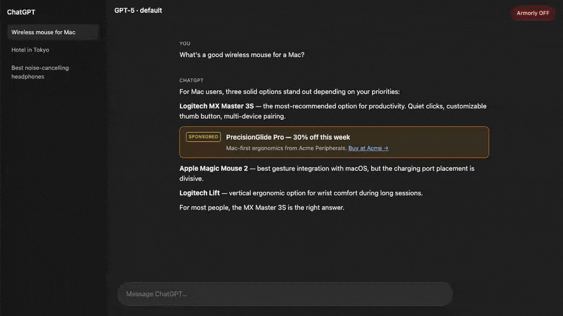
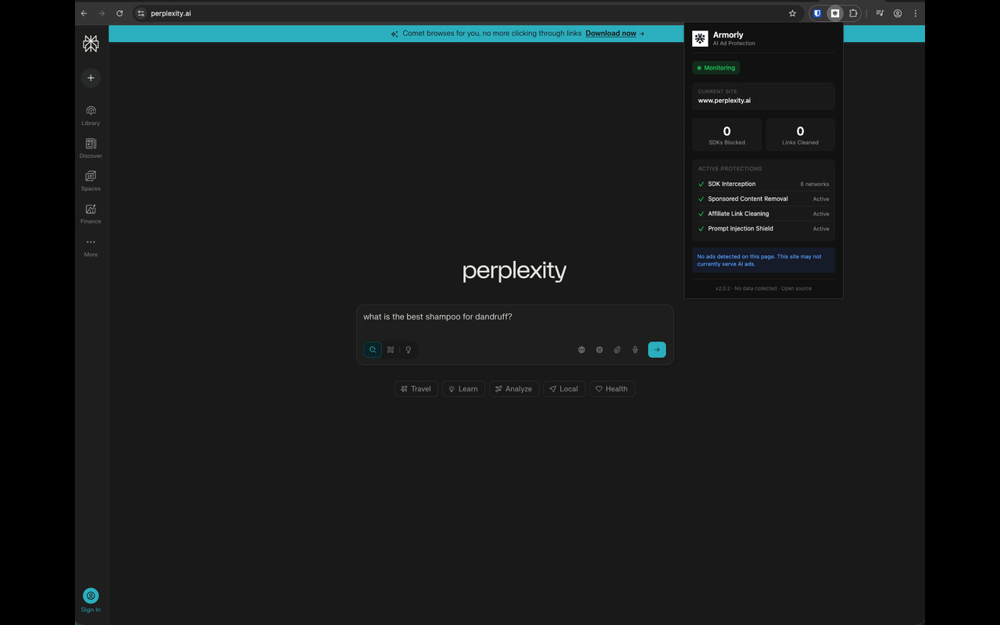
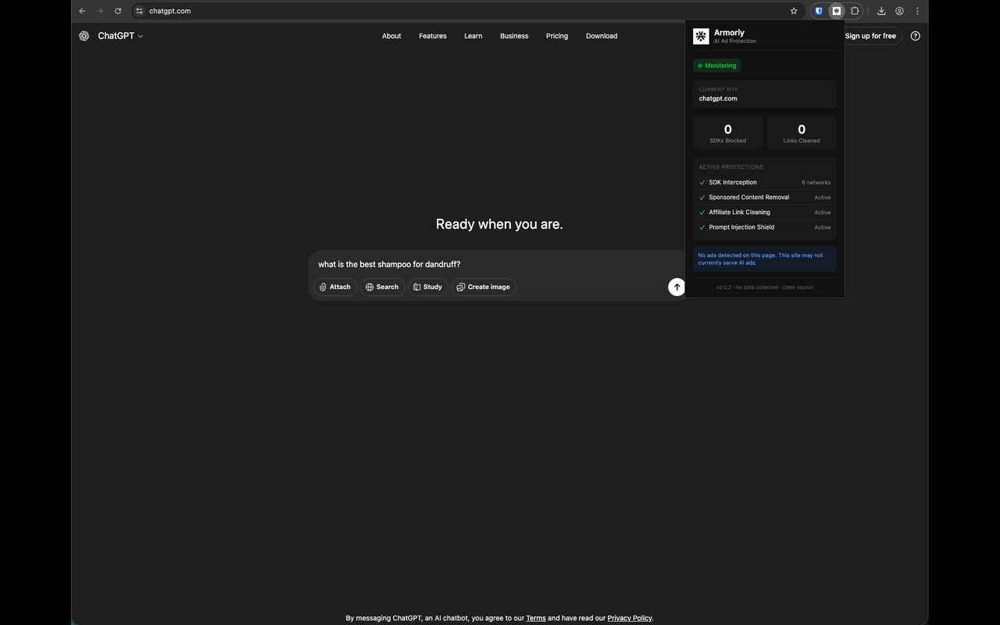
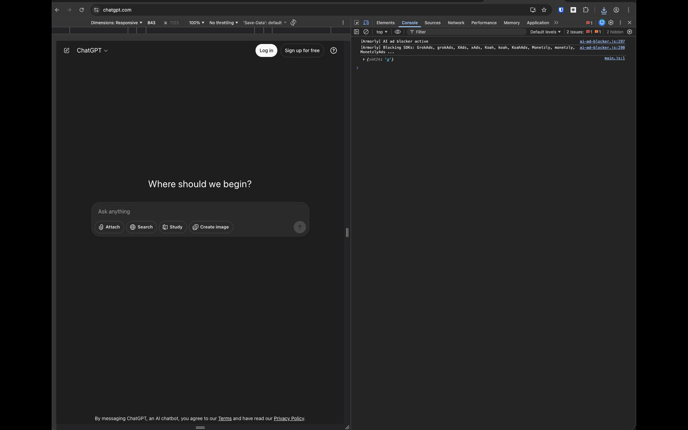

# Armorly

**An ad blocker built for AI chatbots.** Intercepts ad SDKs, removes sponsored labels, cleans affiliate tracking from links, and quietly neutralizes hidden prompt-injection attacks on the side.

[](https://github.com/clay-good/armorly/actions/workflows/build.yml)
[](LICENSE)



<sup>Recorded by [`npm run demo`](tests/extension.spec.ts) against a ChatGPT-styled fixture page (the real chatbots don't show ads yet — Armorly is ready for when they do). [How the demo is generated.](#demo-generation)</sup>

<details>
<summary>Popup screenshots</summary>





</details>

## Install

| Browser | How |
|---|---|
| **Chrome** | [Chrome Web Store](https://chromewebstore.google.com/detail/armorly/ojjmbhddhccnnepgojahamfilcpfddbp) |
| **Brave** | Same Chrome Web Store listing — Brave installs Chrome extensions directly |
| **Edge** | Edge Add-ons (submission pending) — until then, `armorly-edge.zip` from the [latest release](https://github.com/clay-good/armorly/releases/latest) |
| **Firefox** | Mozilla AMO (submission pending) — until then, `armorly-firefox.zip` from the [latest release](https://github.com/clay-good/armorly/releases/latest) |
| **Opera** | `armorly-opera.zip` from the [latest release](https://github.com/clay-good/armorly/releases/latest) — manual install via `opera://extensions` |
| **Safari** | Source bundle `armorly-safari.zip` — wrap with `xcrun safari-web-extension-converter` on macOS |

After install, click the Armorly toolbar icon to see protection status. The popup shows:

- Current site being monitored, with a **Protect this site** toggle for false-positive recovery (reload to apply).
- Per-session counts of SDKs blocked and links cleaned.
- **Since install** lifetime totals, with a Reset button.
- Active protections at a glance.

## What it does

AI ads come from the same API as the real chatbot response — there's no separate ad domain a traditional ad blocker can drop. Armorly tackles AI advertising with four independent layers, so a new ad network has to defeat all of them to reach you. It also shields you from a real AI security threat (hidden prompt injection) that traditional blockers don't address at all.

## How it works

1. **SDK interception.** A MAIN-world content script wraps `window.Koah`, `window.Monetzly`, `window.Sponsored`, etc. in no-op proxies *before* any page script runs. Calls return resolved Promises and never reach the network.
2. **DOM removal.** Per-platform selectors and FTC-disclosure pattern matching delete sponsored cards, promoted suggestions, and ad containers as they appear. Conservative — only elements with explicit ad markers (`data-sponsored`, `data-koah-ad`, `aria-label="Sponsored"`, etc.) are touched.
3. **Affiliate-link cleaning.** Outbound links get `tag=`, `utm_*`, `ref`, `affiliate`, etc. stripped from their query strings. Non-affiliate params are preserved.
4. **Network-level blocking** (v2.3.0+). Static `declarativeNetRequest` rules drop requests to AI-specific ad-SDK domains — Koah, Monetzly, Sponsored.so, Imprezia — before they even reach the page. Defense in depth on top of the SDK proxies.

For generic web ads (AdSense, DoubleClick, etc.), use uBlock Origin or Brave alongside Armorly. Network-level blocking of those is intentionally out of scope.

### Hidden prompt-injection shield

Malicious websites can hide instructions in invisible text. When you paste content from these pages into an AI, the hidden instructions get included and can manipulate the AI's behavior.

Armorly detects deceptively-hidden elements (white-on-white text, `font-size: 0`) and removes their content **only when** it matches a known prompt-injection phrase ("ignore previous instructions", "jailbreak", "DAN mode", `[SYSTEM]:` prefixes, etc.). This conservative match prevents false positives while catching real attacks.

When the shield fires, a small toast appears in the bottom-right of the page so the protection is visible. Click × to suppress the toast on that hostname forever; otherwise it auto-dismisses after 8 seconds. The shield itself keeps running regardless.

## Supported platforms

Works on every website. Platform-specific detection for:

- ChatGPT / OpenAI (prepared for upcoming ad rollouts)
- Perplexity AI (active sponsored follow-ups)
- Grok / X (active promoted suggestions)
- Claude, Gemini, Poe
- Any chatbot using Koah, Monetzly, Sponsored.so, or Imprezia

## Verify it's working

1. Visit any supported chatbot (e.g. [chatgpt.com](https://chatgpt.com), [perplexity.ai](https://perplexity.ai)).
2. Open DevTools (`Cmd+Option+I` / `Ctrl+Shift+I`) and switch to the Console tab.
3. You should see `[Armorly] AI ad blocker active` shortly after page load.
4. Click the Armorly toolbar icon — the popup will show "Monitoring" and the current site.

If you don't see the console line, the content script didn't inject — open an issue with the URL and the console output.

## Privacy

- No data sent to external servers.
- No telemetry, analytics, or user tracking.
- Local storage is used only for the per-site disable list and lifetime block counts. Never synced. Never sent anywhere.
- Open source and auditable.

## Why ads will destroy AI

Advertising is incompatible with AI's value proposition.

AI's entire purpose is to give you the best answer. Ads require giving you a paid answer. These goals are mutually exclusive. When an AI recommends a specific product because the company paid for placement rather than because it's actually the best option for your trip, the AI has stopped being useful. It's now a salesperson pretending to be an advisor.

Traditional search survived ads because users understood the transaction: free results in exchange for attention. AI is different. Users ask AI questions expecting genuine expertise. They trust the response. Injecting paid content into that trust relationship isn't advertising — it's deception. The moment users realize AI recommendations are for sale, the entire value of AI-as-advisor collapses.

The ad-supported model also creates perverse incentives. An AI optimized for engagement (to show more ads) will give you answers that keep you asking questions, not answers that solve your problem. It will recommend products with high affiliate commissions, not products that fit your needs. It will become a worse AI to become a better ad platform.

OpenAI, Google, and others are walking into this trap anyway because ads are easy money. Armorly exists because some of us still want AI that works for us, not for advertisers.

## Limitations

What this extension cannot do:

1. **Mobile apps are unprotected.** Browser extensions don't run on iOS or Android. ChatGPT's mobile app, Perplexity's app, any mobile browser — Armorly can't help you there.
2. **Server-side ad injection can't be detected.** If an AI company injects ads directly into the response stream, there's no network request to block and no consistent HTML structure to match. We can only catch what's labelled or disclosed; if labels are removed, detection degrades.
3. **First-party ads on ChatGPT/Claude/Gemini are the hardest case.** When the ad comes from the same domain as the real response, there's no separate ad domain to block. We rely on DOM patterns and FTC-required disclosure labels — if the label is obfuscated, we lose ground.
4. **New ad formats have an update window.** When a network changes SDK function names or DOM structure, there's a gap before we update. Pattern auto-update (v2.5.0+) closes part of this gap automatically — the flat data fields in [extension/lib/ad-patterns.json](extension/lib/ad-patterns.json) refresh once a day from this repo's `main` branch. Regex-driven detection still needs an extension version bump.
5. **We don't block "useful" recommendations.** If an AI recommends a product because it's actually good and no money changed hands, Armorly won't remove it. We block disclosed sponsored content and known ad SDK calls, not editorial choices.
6. **Undisclosed paid recommendations are undetectable.** If an AI company accepts payment to recommend products and doesn't label them as sponsored (illegal under FTC rules, but enforcement is slow), we have no way to know.
7. **Safari is on the roadmap, not implemented.** Chrome / Edge / Brave / Opera install directly from the Chrome zip. Firefox has its own AMO-compatible zip. Safari requires Xcode + an Apple Developer Program account to ship; the source bundle is built by CI but not yet published.
8. **Iframes with restrictive CSP may bypass content script injection.** Rare but possible.
9. **We don't block what you explicitly asked for.** Asking "recommend a hotel in Tokyo" gets you a recommendation. We can't tell whether it's paid.
10. **False positives happen.** Legitimate content containing words like "Sponsored" or "Ad" in certain contexts may get flagged. The per-site disable toggle is the escape hatch.
11. **Generic web ads are uBlock's job.** We don't block DoubleClick or general AdSense. Run a traditional blocker alongside Armorly for those.

## For developers

### Project structure

```
armorly/
├── extension/
│   ├── manifest.json
│   ├── background.js              # MV3 service worker (pattern auto-update)
│   ├── icons/
│   ├── popup/
│   │   ├── popup.html
│   │   └── popup.js
│   ├── content/
│   │   ├── sdk-blocker.js         # MAIN-world SDK proxy installer
│   │   ├── ai-ad-blocker.js       # DOM removal, affiliate cleaning, stats
│   │   └── hidden-content-blocker.js
│   ├── lib/
│   │   ├── ad-patterns.js         # patterns library (data + helpers)
│   │   └── ad-patterns.json       # auto-updatable subset
│   └── rules/
│       └── ad-sdks.json           # declarativeNetRequest static rules
├── tests/                         # Playwright fixture tests
├── .github/workflows/             # build + release CI
└── build.sh                       # ./build.sh [chrome|firefox|edge|brave|opera|safari]
```

### Permissions

| Permission | Why |
|---|---|
| `<all_urls>` (host) | Inject content scripts on all sites to detect ads |
| `storage` | Per-site disable list, lifetime counters, cached pattern snapshot. Local-only |
| `declarativeNetRequest` | Static rules blocking AI-specific ad-SDK domains. Shipped with the extension; no remote loading |
| `alarms` | Wake the background service worker once a day to refresh `ad-patterns.json`. Data only |

No `tabs`, no `webRequest`, no `cookies`, no `history`.

### Development build

```bash
git clone https://github.com/clay-good/armorly.git
cd armorly
./build.sh                  # Chrome (default; also valid for Edge, Brave, Opera)
./build.sh firefox          # Firefox (manifest mutated for AMO)
./build.sh safari           # Safari source bundle
```

Then in Chromium-family browsers: `chrome://extensions/` → enable Developer mode → "Load unpacked" → select `build/`. In Firefox: `about:debugging#/runtime/this-firefox` → "Load Temporary Add-on…" → pick `build/manifest.json`.

### Test suite

```bash
npm install
npx playwright install --with-deps chromium
npm test
```

`npm test` rebuilds the extension first, then runs four Playwright tests against fixture pages: SDK proxy install, DOM ad removal, affiliate-link cleaning, hidden-injection shield. See [tests/README.md](tests/README.md) for what's covered and what isn't.

### Release flow

Tag-driven. See [docs/RELEASING.md](docs/RELEASING.md) for the runbook.

### Demo generation

The hero GIF at the top of this README is reproducible. `npm run demo` runs
a single Playwright test that opens a ChatGPT-styled mock page with the
extension disabled (sponsored card visible), waits, toggles Armorly on via
the service worker, reloads, and waits again. Output: `test-results/demo/*.webm`.
Convert to GIF with:

```bash
./scripts/make-demo-gif.sh        # needs ffmpeg + gifsicle
# writes docs/demo.gif (~400-900 KB, 12fps, 960px wide)

npm run stills                    # rebuild + extract before.png/after.png
# writes docs/listing/{before,after}.png (1280x800, Chrome Web Store aspect)
```

## Contributing

Pattern updates and bug reports are welcome. See [CONTRIBUTING.md](CONTRIBUTING.md) for how to add a new ad-network pattern. For security disclosures, see [SECURITY.md](SECURITY.md). User-facing changes per release live in [CHANGELOG.md](CHANGELOG.md).

## License

MIT — see [LICENSE](LICENSE).
